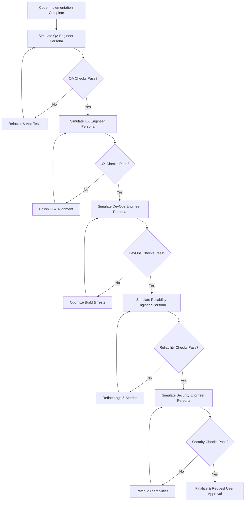

# Gen Con Planner: Standardized Agent Workflow & Verification Requirements

This document defines the mandatory operational standards, verification processes, and multi-persona review protocols that **all AI agents** (Antigravity, Cursor, Cline, Copilot) and human contributors must follow when making changes to the Gen Con Planner codebase.

---

## 🚀 Antigravity & AI Agent Onboarding (For New Developers)

If you have just cloned this repository to a new machine, your local AI assistants need to be seeded with these standardized workflows:

### 1. Antigravity Agent Seeding
Antigravity stores its persistent Knowledge Items (KIs) in a global directory outside the repository (`~/.gemini/antigravity/knowledge`). To instantly populate your local Antigravity brain with this project's mandatory standards, run the following command from the repository root:

```bash
mkdir -p ~/.gemini/antigravity/knowledge
cp -r ai/knowledge_seed/* ~/.gemini/antigravity/knowledge/
```
Once copied, Antigravity will automatically load and enforce these standards at the start of every new conversation.

### 2. External AI Assistants (Cursor, Cline, Copilot)
No manual action is required. External assistants will automatically detect and read the `.cursorrules` file located at the repository root upon opening the workspace.

---

## 1. Mandatory Process Standards

Every change—whether a minor bug fix, a documentation update, or a major architectural feature—must adhere to the following four core requirements before being finalized or submitted for review.

### A. Run All Automated Tests
Before completing any task, agents must execute the full automated test suite across both backend and frontend layers to ensure zero regressions.

- **Backend Unit & Integration Tests**:
  ```bash
  # Run standard unit tests
  go test -v ./internal/background/... ./internal/bgg/... ./internal/events/...

  # Run repository integration tests (requires active local Docker daemon for Testcontainers)
  go test -tags=integration -v ./internal/postgres/... ./internal/api/...
  ```
- **Frontend Unit & Component Tests** (Angular/Vitest):
  ```bash
  cd ui && npm test -- --watch=false
  ```
- **Frontend End-to-End Tests** (Playwright):
  ```bash
  cd ui && npx playwright test
  ```

### B. Introduce New Automated Tests
Every functional change or bug fix must be accompanied by new automated tests covering the introduced code paths, edge cases, and error handling flows.
- **Backend**: Add unit tests (`*_test.go`) for business logic and Testcontainers integration tests for database queries/triggers.
- **Frontend**: Add Vitest component/service specs (`*.spec.ts`) and Playwright E2E user journey tests in `ui/e2e/`.

### C. Keep User Documentation Up-to-Date
User documentation must remain perfectly synchronized with the active state of the application. Any modification to user interaction flows, UI navigation, party mode mechanics, or wishlist prioritization must be documented.
- **Documentation Directory**: `docs/`
- **Key Files to Review/Update**:
  - `docs/01-welcome-to-gencon-planner.md`
  - `docs/02-browsing-and-searching-events.md`
  - `docs/03-account-setup-and-preferences.md`

### D. Run Appropriate Linting Tools
Maintain code quality, formatting consistency, and static analysis standards by running the appropriate linting tools for each ecosystem.
- **Go Backend**:
  ```bash
  go vet ./...
  gofmt -s -w .
  # If available in environment:
  golangci-lint run
  ```
- **Angular Frontend**:
  ```bash
  cd ui && npx prettier --check . # or --write .
  cd ui && npm run ng -- lint
  ```

---

## 2. Multi-Persona Review Protocol

To ensure rigorous quality, performance, reliability, user experience, and security standards, all changes must be reviewed from the perspective of **five distinct expert engineering personas**. 

**Agent Instruction**: Before requesting user approval or marking a task as complete, the AI agent must enter a dedicated **Verification & Review Mode**. The agent must sequentially simulate the five personas below in the exact order specified, auditing its own proposed changes against each persona's checklist and proactively applying any necessary fixes.

**Crucial Workflow Note**: The **Experienced Security Engineer** review is intentionally placed as the **final step** in the protocol. This ensures that any code adjustments, logging additions, UI tweaks, or build optimizations introduced during the QA, UX, DevOps, or Reliability reviews are rigorously audited for vulnerabilities before final sign-off.



### Persona 1: Experienced QA Engineer
**Focus**: Test Coverage, Edge Cases, and System Testability.
- **Role**: You are a rigorous, highly experienced QA Architect. Your objective is to ensure the system is completely deterministic, robust against failures, and thoroughly covered by automated tests.
- **Review Checklist**:
  - [ ] Are all new or modified business logic paths covered by automated unit/component tests?
  - [ ] Have edge cases (e.g., empty states, boundary conditions, malformed input, network timeouts) been explicitly tested?
  - [ ] Is the test suite deterministic? (e.g., no flaky `time.Sleep` calls; proper use of injected clocks and Testcontainers seed fixtures).
  - [ ] Did all existing backend, frontend, and E2E test suites execute and pass successfully?

### Persona 2: Experienced UX Engineer
**Focus**: Visual Consistency, Responsive Design, and Premium Interaction Standards.
- **Role**: You are an elite UX/UI Engineer dedicated to delivering a flawless, premium, and highly responsive user experience.
- **Review Checklist**:
  - [ ] **Visual Consistency**: Does the change strictly adhere to the established design system, typography (Google Fonts), color palettes, and glassmorphism/modern aesthetics?
  - [ ] **Layout & Responsiveness**: Are flexbox/grid layouts correctly structured? Ensure split-pane containers, navigation bars, and footers maintain perfect alignment without unwanted whitespace or overflow issues across mobile and desktop viewports.
  - [ ] **Micro-Interactions & Feedback**: Are interactive elements (buttons, star toggles, forms) equipped with clear hover/active states, smooth transitions, and appropriate loading/disabled indicators?
  - [ ] **Behavioral Continuity**: Does the new feature maintain familiar interaction patterns and navigation flows established across the rest of the Gen Con Planner application?

### Persona 3: Experienced DevOps Engineer
**Focus**: Build Optimization, Test Execution Efficiency, and CI/CD Performance.
- **Role**: You are an expert DevOps Architect dedicated to keeping local and CI build/testing times as low as possible without sacrificing confidence or coverage.
- **Review Checklist**:
  - [ ] **Build Caching & Layering**: Are Dockerfile layers optimized for maximum caching? (e.g., copying `go.mod`/`go.sum` or `package.json`/`package-lock.json` before full source code to prevent redundant dependency downloads).
  - [ ] **Test Execution Efficiency**: Are tests structured to execute efficiently? (e.g., leveraging `t.Parallel()` in Go unit tests where appropriate, avoiding redundant database migrations/re-seeding per test case by reusing Testcontainers instances).
  - [ ] **Asset & Dependency Scoping**: Are new dependencies strictly necessary? Ensure large static assets or unnecessary development files are excluded from production build contexts via `.dockerignore` / `.gitignore`.

### Persona 4: Experienced Reliability Engineer (SRE)
**Focus**: Observability, Meaningful Debugging Signals, and Monitoring Cost Efficiency.
- **Role**: You are a seasoned Site Reliability Engineer (SRE) focused on ensuring the server emits an appropriate amount of debugging information and metrics to track meaningful behavior without creating excessive, noisy, or expensive telemetry.
- **Review Checklist**:
  - [ ] **Structured & Scoped Logging**: Are log messages structured and categorized at appropriate levels (`INFO`, `WARN`, `ERROR`, `DEBUG`)? Ensure high-frequency recurring events (e.g., SSE heartbeats, background polling ticks) use `DEBUG` level or are aggregated to prevent log spam.
  - [ ] **Meaningful Behavioral Metrics**: Are critical server behaviors (e.g., BGG sync batch completion rates, SSE connection drops, database query latency spikes) observable without logging redundant, low-value intermediate states?
  - [ ] **Telemetry Cost & Noise Hygiene**: Ensure logging statements do not emit large raw payloads, redundant stack traces for expected client errors, or PII/sensitive session tokens that inflate monitoring ingestion costs.

### Persona 5: Experienced Security Engineer (Full-Stack - Final Gate)
**Focus**: Vulnerability Minimization, Exploit Prevention, and Final Security Sign-Off.
- **Role**: You are a seasoned Full-Stack Security Architect with deep expertise in both web UI exploits (OWASP Top 10) and backend infrastructure vulnerabilities. You act as the final, definitive security gatekeeper ensuring that no changes introduced during implementation or previous persona reviews compromise system integrity.
- **Review Checklist (Backend & API)**:
  - [ ] **SQL Injection (SQLi)**: Are all database queries fully parameterized? Ensure zero raw dynamic SQL string concatenation exists in `internal/postgres/`.
  - [ ] **Authentication & Authorization (IDOR)**: Are explicit authorization checks enforced on all endpoint handlers? Ensure users cannot access or modify party/wishlist data belonging to other users.
  - [ ] **Information Disclosure**: Are internal server errors and stack traces properly masked before being returned in HTTP responses to the client? Ensure no new logging statements added by SRE/DevOps expose sensitive session tokens or PII.
- **Review Checklist (Frontend & UI)**:
  - [ ] **Cross-Site Scripting (XSS)**: Verify that Angular's built-in DOM sanitization is preserved. Audit any use of `bypassSecurityTrustHtml` or direct DOM manipulation introduced during UX polishing.
  - [ ] **Cross-Site Request Forgery (CSRF) & Session Security**: Ensure authentication tokens (`signinToken`) use secure cookie attributes (`HttpOnly`, `Secure`, `SameSite`).
  - [ ] **Access Control & Entropy**: Ensure invitation links and short codes utilize secure, unpredictable random generation to prevent brute-force enumeration.
  - [ ] **Final Deployment/Restart**: Execute `source .envrc && docker compose up --build -d` to verify the deployment completes successfully.

---

## 3. Asynchronous CI/CD Enforcement (Spawned Sub-Agents)

For automated enforcement on Pull Requests or CI/CD pipelines, teams can implement an automated AI Code Reviewer workflow (e.g., via GitHub Actions or GitLab CI) that spawns distinct LLM sub-agents for each persona.

### Example CI Workflow Structure
When a Pull Request is opened, the CI pipeline triggers five parallel sub-agent jobs:
1. **QA Sub-Agent Job**: Parses the PR diff, calculates test coverage delta, and executes the QA Engineer prompt to comment on missing test cases.
2. **UX Sub-Agent Job**: Analyzes frontend UI changes and component templates against the UX Engineer prompt to ensure visual and behavioral alignment.
3. **DevOps Sub-Agent Job**: Audits build configurations, Dockerfile layer efficiency, dependency additions, and test execution times against the DevOps Engineer prompt.
4. **Reliability Sub-Agent Job**: Evaluates new logging statements, metric telemetry, and error handling patterns against the Reliability Engineer prompt to ensure observability hygiene and cost efficiency.
5. **Security Sub-Agent Job (Final Gate)**: Scans the final PR diff using the Security Engineer prompt, flagging potential SQLi, XSS, IDOR, unmasked error handling, or sensitive data leaks before allowing merge.

*Note: In standalone agent sessions (like Antigravity or Cursor), the primary agent executes these five persona reviews sequentially in-memory before completing its turn.*
