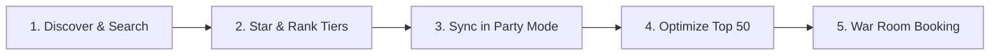

# Welcome to Gen Con Planner

## What is Gen Con Planner?
Gen Con Planner is an advanced, community-driven event discovery and collaborative scheduling platform designed to supercharge your Gen Con experience. While the official Gen Con event catalog is functional for basic registration, it can be challenging to navigate when evaluating thousands of events, coordinating schedules with friends, or trying to understand which board games are right for your group.

Gen Con Planner solves this by combining lightning-fast search, rich BoardGameGeek (BGG) community data, tiered interest starring, and robust multi-user "Party Mode" collaboration into a single, seamless web application.

## Key Features & Advantages

### 🎲 BoardGameGeek (BGG) Integration
Stop opening new tabs to research game titles. Gen Con Planner automatically matches event listings against BoardGameGeek's database, injecting critical community metrics directly into event summaries:
- **BGG Rating**: See how the global board gaming community scores the game.
- **Complexity Weight**: Instantly gauge whether a game is a lightweight party game (1.0 - 2.0) or a heavy, brain-burning euro strategy game (3.5 - 5.0).
- **Direct Links**: Jump straight to the official BGG page for deep-dive reviews and rulebooks.

> [!IMPORTANT]
> **Data Usage & AI Scraping Policy**: To comply with BoardGameGeek API Terms of Service, Gen Con Planner strictly prohibits the use of BGG community data for training Artificial Intelligence or Large Language Models (LLMs). We actively enforce this policy at the server level by blocking automated AI crawlers and scrapers via comprehensive `robots.txt` directives.

### ⭐ Tiered Wishlist Curation
Not all events are created equal. Instead of a binary "add to wishlist" button, Gen Con Planner allows you to rank your excitement using three distinct tiers:
- **Must Have**: Your absolute top priorities.
- **Very Interested**: Great events you'd love to attend.
- **Somewhat Interested**: Excellent backup options to fill gaps in your schedule.

### 🛡️ Smart Schedule Protection
Gen Con is a marathon. Gen Con Planner helps you protect your energy by allowing you to configure custom **Blocked Times** (e.g., locking out 12:00 PM - 1:30 PM for lunch) and **Flexible Breaks** (ensuring you always have at least a 45-minute breather between intense RPG sessions).

### 🤝 Party Mode Collaboration
Planning with a group has never been easier. Create a party, invite your friends via secure short codes, and watch your schedules sync in real-time. The platform aggregates everyone's interest tiers into a unified group consensus, helping you identify exactly which events maximize attendance for your entire table.

---

## How It Works: The Planning Lifecycle

1. **Discover & Search**: Explore the catalog by category or use advanced filters to find the perfect sessions.
2. **Star & Rank Tiers**: Tag events with your personal interest levels (`Must Have`, `Very Interested`, `Somewhat Interested`).
3. **Sync in Party Mode**: Join forces with friends to align schedules, identify conflicts, and agree on group priorities.
4. **Optimize Top 50**: Let the automated engine compile your ultimate 50-item wishlist, capping duplicate sessions to maximize your chances on registration day.
5. **War Room Booking**: Coordinate live locks and purchases with your team as Gen Con processes wishlists.

---

## Navigating the Platform

When you open Gen Con Planner, you'll find an intuitive navigation bar at the top of your screen giving you instant access to core areas:
- **Catalog (`/cat/[year]`)**: Browse events broken down by major categories (Board Games, RPGs, Anime, etc.).
- **Search (`/search`)**: Use powerful filtering tools to pinpoint specific game systems, keywords, or time slots.
- **Starred / Wishlist (`/starred/[year]`)**: Switch between Calendar and List views to manage your personal schedule and generate your top-50 export.
- **Party Hub (`/party/[id]`)**: Your collaborative command center for group alignment, member management, and financial expense splitting.

---
> [!TIP]
> Ready to dive in? Head over to [Browsing & Searching Events](./02-browsing-and-searching-events.md) to start exploring the catalog, or check out [Account Setup & Preferences](./03-account-setup-and-preferences.md) to secure your profile!
