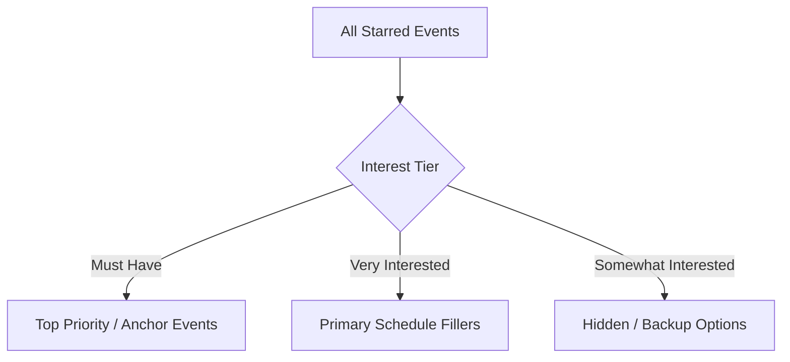

# Curating Your Wishlist with Interest Tiers

When planning for Gen Con, a simple binary "add to wishlist" button fails to capture the nuance of your excitement. If you add 40 events to your wishlist, how do you decide which ones get submitted first? How does the system know what to pick if two events overlap?

Gen Con Planner solves this by introducing a **Tiered Interest Starring System**. Instead of just starring an event, you categorize your enthusiasm into three distinct priority levels.

---

## 1. The Three Interest Tiers

Whenever you view an event cluster or a specific session, clicking the **Star Button** reveals a dropdown menu with three tiers:

```
┌────────────────────────────────────────────────────────┐
│ ⭐ Star Event Cluster                                  │
│                                                        │
│  [★ Must Have]             ──► Top priority locks      │
│  [★ Very Interested]       ──► Primary schedule goals  │
│  [★ Somewhat Interested]   ──► Excellent backups       │
└────────────────────────────────────────────────────────┘
```

### 🔴 Must Have
- **Definition**: Your absolute favorite, non-negotiable events. These are the games or experiences you are building your entire convention around.
- **System Impact**: The Wishlist Prioritization Engine places these at the very top of your Gen Con submission queue. If you are in a planning party, the system actively alerts group members to avoid booking conflicting events during these time slots.

### 🟡 Very Interested
- **Definition**: Highly desirable events that you would be thrilled to attend, provided they don't conflict with your `Must Have` selections.
- **System Impact**: Forms the core body of your schedule. The optimization engine uses these to fill the majority of your 50 available wishlist slots.

### 🔵 Somewhat Interested
- **Definition**: Excellent backup options, casual seminars, or drop-in games that sound fun if you find yourself with free time.
- **System Impact**: Treated as secondary filler. The engine includes these in your final export only if your higher-tier events leave open schedule gaps or if you need backup options for high-demand slots.

---

## 2. Group Starring vs. Individual Session Starring

Gen Con Planner gives you the flexibility to express interest at both the macro (Game/Cluster) level and the micro (Specific Session) level.

### Starring an Event Cluster (Group Level)
When browsing the Category Detail view, starring an entire cluster (e.g., *Scythe*) applies your chosen interest tier to **all available sessions** of that game. 
- **Why do this?** If you just want to play *Scythe* and don't care whether it's on Thursday morning or Friday afternoon, starring the cluster lets the optimization engine find the specific session that fits perfectly into your schedule.

### Starring a Specific Session (Instance Level)
If you only want to attend a specific session (e.g., because your friend is running the Saturday night game), you can click into the Event Detail view and star that specific session. 
- **Why do this?** Prevents the system from scheduling you for Thursday morning when you are only available for the Saturday night slot.

---

## 3. How Tiers Influence Your Personal Agenda

As you star events, your selections immediately populate your **Starred Events Dashboard** (`/starred`). 



By assigning proper tiers, your calendar view transforms from a chaotic wall of overlapping boxes into an organized hierarchy where your primary goals clearly stand out above your backup options.

---
> [!TIP]
> Now that you've ranked your favorite events, learn how to organize them on your calendar and set up rest breaks in [Managing Your Schedule & Time Blocks](./05-managing-schedule-and-time-blocks.md).
