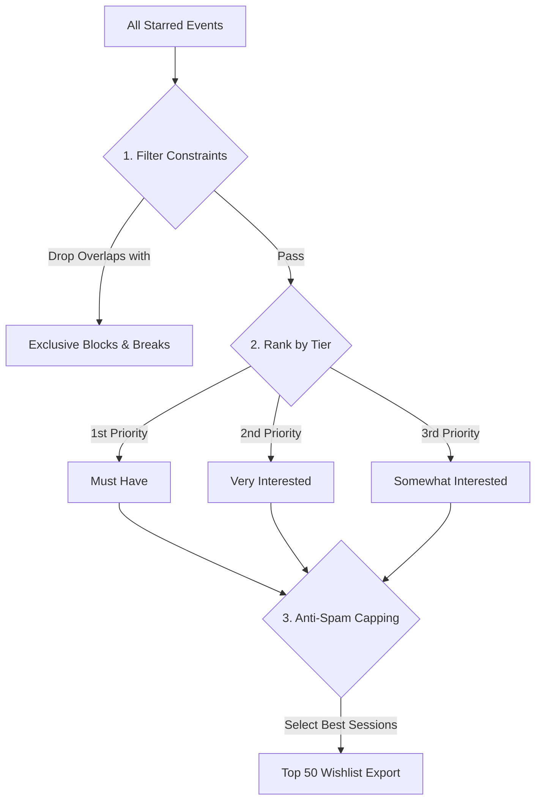

# Generating & Submitting Your Final Wishlist

The ultimate goal of your planning efforts is preparing for Gen Con's official event registration window. Gen Con limits your submitted wishlist to a maximum of **50 events**. 

If you've starred 80 different sessions across your favorite games, how do you choose the perfect 50? Gen Con Planner features an automated **Wishlist Prioritization Engine** designed to build the optimal submission queue for you.

---

## 1. How the Prioritization Engine Works

When you click **Generate Personal Wishlist** from your dashboard, the engine evaluates your entire starred inventory using a sophisticated multi-pass algorithm:



### Step 1: Constraint & Ticket Availability Filtering
The engine first strips out any event sessions that violate your custom Time Blocks or Flexible Breaks. It also checks live ticket counts, prioritizing sessions that still have valid ticket inventory over those that are already sold out.

### Step 2: Tier & Party Scoring
Events are sorted primarily by your Interest Tiers (`Must Have` > `Very Interested` > `Somewhat Interested`). If you are part of a planning party, the engine applies secondary tie-breaker points based on your profile preference modifiers (`Better with others`, `Worth alone`) and how many fellow party members are also interested in the same session.

### Step 3: Anti-Spam Group Capping
If you star an event cluster that has 30 identical sessions (like a popular escape room), submitting all 30 sessions to Gen Con would waste 60% of your wishlist capacity!
- **Smart Capping**: The engine identifies duplicate sessions belonging to the same event group (`cluster_id`) and intelligently caps the number of instances included in your final export. It selects the 2 or 3 optimal sessions that maximize your schedule flow and party attendance, leaving your remaining wishlist slots open for other unique game titles.

---

## 2. Altruistic Filling: "Fill for Others"

If your personal wishlist contains fewer than 50 events, you can enable the **Fill for Others** toggle before generating your list.

```
┌────────────────────────────────────────────────────────┐
│ 🤝 Altruistic Wishlist Filling                         │
│                                                        │
│  Your Wishlist Count: 35/50 Slots Used                 │
│  [☑] Fill remaining 15 slots with Party Must-Haves     │
└────────────────────────────────────────────────────────┘
```

### How It Works
When enabled, the engine looks at the `Must Have` wishlists of your fellow party members. If a friend needs a high-demand ticket and the session fits perfectly into an empty gap in your personal schedule, the engine will automatically add that event to your wishlist queue.
- **Clear Labeling**: To prevent confusion, these items are explicitly tagged in your UI as *"In wishlist for [Friend's Name]"*. If your wishlist gets processed before theirs on registration day, you can secure the ticket on their behalf!

---

## 3. Exporting & Tracking Official Submission

Once your 50-item wishlist is generated and verified on your screen, it's time to transfer it to the official Gen Con registration portal (`gencon.com`).

### Manual Transfer & Timestamp Tracking
1. Open a second browser tab and log into your official account at `gencon.com`.
2. Using your Gen Con Planner wishlist as a precise guide, search for and add the corresponding event numbers to your official Gen Con queue. *(Tip: Power users can use our companion Chrome extension to help organize this process!)*
3. Once your official wishlist is fully assembled on the Gen Con portal, return to Gen Con Planner and click the **Mark as Submitted** button.
4. **Timestamp Tracking**: Gen Con Planner records the exact date and time of your submission, displaying a reassuring *"Wishlist Assembled & Submitted on [Timestamp]"* badge at the top of your dashboard.

---
> [!SUCCESS]
> Congratulations! You have mastered the wishlist building process. If you are planning with friends, take your coordination to the next level by exploring **Section 3: Party Mode & Group Coordination**, starting with [Introduction to Party Mode](./07-introduction-to-party-mode.md).
