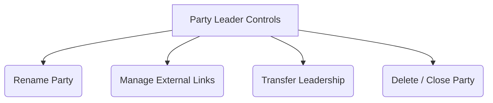

# Introduction to Party Mode

Attending Gen Con with friends is one of the most rewarding ways to experience the convention. However, trying to coordinate schedules across multiple group chats, spreadsheets, and calendar invites can quickly turn into an administrative nightmare.

Gen Con Planner introduces **Party Mode**, a dedicated collaborative workspace designed to align your group's schedules, synchronize interest tiers, and streamline ticket purchasing.

---

## 1. Creating a Party & The "One Per Year" Rule

To keep group coordination focused and avoid schedule conflicts across different friend circles, Gen Con Planner enforces a strict **One Party Per Year** rule: a user can create or join only one party per Gen Con convention year.

### How to Create a Party
1. Navigate to the **Party Hub** by clicking `Party` in the top navigation bar.
2. If you are not currently in a party for the active convention year, click **Create New Party**.
3. Enter a recognizable name for your group (e.g., *"The Dragon Slayers 2026"*).
4. You are now officially the **Party Leader**!

---

## 2. Inviting Friends via Short Codes

Once your party is established, you need to bring your friends on board. Instead of passing around clunky database IDs or requiring manual email invites, Gen Con Planner generates secure, easy-to-share invitation links.

```
┌────────────────────────────────────────────────────────┐
│ 🔗 Party Invitation Link                               │
│                                                        │
│  Short Code: [CODE2026]                                │
│  URL: https://genconplanner.com/join/CODE2026          │
│  [📋 Copy Invite Link]                                  │
└────────────────────────────────────────────────────────┘
```

### Onboarding New Members
1. From the Party Hub settings tab, locate your group's unique alphanumeric `short_code`.
2. Click **Copy Invite Link** to grab the direct join URL.
3. Paste the link into your group chat (Discord, WhatsApp, SMS, etc.).
4. When your friends click the link, they will be prompted to log in and confirm joining your party. Once accepted, their avatars and schedules immediately appear in your Party Hub.

---

## 3. Party Leader Administrative Privileges

As the creator of the party, the **Party Leader** holds administrative controls to manage the group's logistics and shared resources.



### Core Leader Responsibilities
- **Renaming the Party**: Update the group's display name at any time to keep things fun or organized.
- **Managing External Links**: Attach essential external planning documents directly to the Party Hub rail. You can link your group's shared Google Docs, Google Sheets, or Splitwise ledger. *(Note: For security, the system restricts external links to trusted domains like `docs.google.com` or `splitwise.com`).*
- **Transferring Leadership**: If you need to step down as organizer, you can transfer Party Leader status to any active member in the group.
- **Deleting / Closing the Party**: A party can only be deleted if it has exactly one member (the Party Leader) and no tickets have been transferred into the group from outside.

---
> [!TIP]
> With your party assembled, it's time to start planning together! Learn how the platform merges everyone's stars into a shared consensus in [Collaborative Wishlist Building](./08-collaborative-wishlist-building.md).
