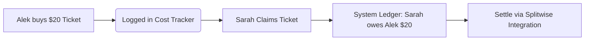

# Managing Tickets, Claims & Financial Tracking

Securing tickets during Gen Con registration is a massive victory, but it introduces a new set of logistical challenges: If User A buys 4 tickets to a board game event, how does the group know whose badges those tickets are assigned to? How does User A get paid back?

Gen Con Planner provides a comprehensive **Ticket Claim & Financial Tracking System** to manage group inventory and settle interpersonal debts seamlessly.

---

## 1. The Claim System: Purchased vs. Claimed Tickets

To maintain perfect accounting clarity, Gen Con Planner separates ticket ownership into two distinct concepts: **Purchased** (who paid for the ticket) and **Claimed** (who is actually attending the event).

```
┌────────────────────────────────────────────────────────┐
│ 🎟️ Ticket Claim Status                                 │
│                                                        │
│  Event: 🎲 Ark Nova Tournament (Saturday 10:00 AM)     │
│  Ticket #1: [Purchased by Alek] ──► [Claimed by Alek]  │
│  Ticket #2: [Purchased by Alek] ──► [Claimed by Sarah] │
└────────────────────────────────────────────────────────┘
```

### How Claims Work
- **Default State**: When a ticket is first logged as purchased, it is initially "claimed" by the person who bought it.
- **Releasing Claims**: If User A bought a ticket for a friend but doesn't know who is taking it yet, User A can click **Release Claim**. The ticket enters the party's **Unclaimed Inventory**.
- **Claiming Tickets**: Any member in the party can browse the Unclaimed Inventory and click **Claim Ticket** to assign that pass to their personal convention schedule.
- **Ticket Types**: The system explicitly tracks whether each pass is a **Digital Ticket** (attached electronically to your Gen Con badge) or a **Physical Ticket** (paper slip that must be handed to the event judge).

---

## 2. Financial Tracking & Settling Debts

Convention expenses can add up quickly. Gen Con Planner eliminates the headache of manual spreadsheet accounting by automatically calculating group debts based on ticket claims.



### Automated Debt Calculation
Whenever User B claims a ticket purchased by User A, the system records the exact purchase price in the group's financial ledger. 
- **Financial Summary View**: Navigating to the Party Hub financial tab displays a clean, consolidated summary showing exactly who owes whom and for which specific event tickets.
- **Splitwise Integration**: If your Party Leader has configured an external Splitwise link in the Party Hub settings, you can click the Splitwise icon to jump directly to your group's shared ledger and settle your balances instantly!

---

## 3. Conflict & Opportunity Analysis

As party members claim tickets, the platform actively scans everyone's schedules to ensure a smooth convention experience.

### Overlap Highlighting (Conflict Detection)
If you accidentally claim a ticket for an event that overlaps with another session on your schedule, the system immediately flags the conflict in red on your Personal Agenda View. *(Note: The system allows you to keep conflicting claims for flexibility—such as holding a backup ticket—but ensures you are fully aware of the overlap).*

### Opportunity Highlighting (Smart Discovery)
When you browse the party's Unclaimed Inventory, the system doesn't just show you a static list of tickets. It actively highlights passes for events that **do not overlap** with your current schedule. This makes it incredibly easy to scoop up spare tickets from friends to fill empty afternoon gaps!

---
> [!IMPORTANT]
> What happens to all these claimed and purchased tickets if someone needs to leave the party? Review the exact persistence rules in [Leaving or Modifying a Party](./10-leaving-or-modifying-a-party.md).
