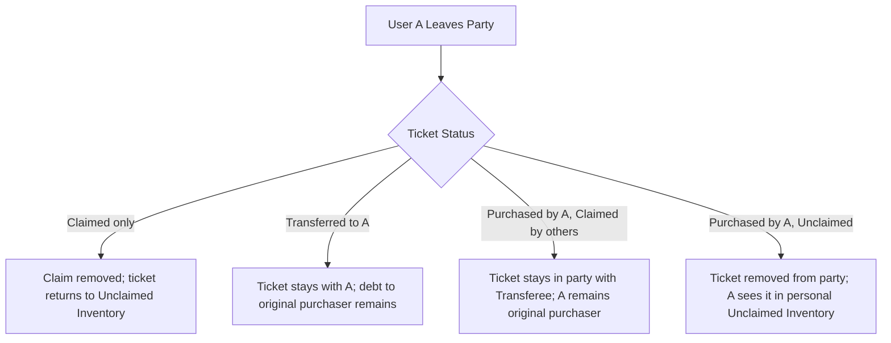

# Leaving or Modifying a Party

While Party Mode is designed for seamless collaboration, real-world plans change. A friend might have to cancel their convention trip, or a group might decide to split into smaller planning circles. 

Because tickets represent real financial purchases and personal badge assignments, Gen Con Planner enforces clear, deterministic rules to handle exactly what happens to tickets and claims when a member leaves a party.

---

## 1. The Fate of Tickets Upon Leaving

When User A clicks **Leave Party**, the system evaluates every ticket associated with them based on its current purchase and claim status:



### Scenario Breakdown

#### 1. Claimed (Not Purchased / Transferred by User A)
- **Situation**: User A claimed a ticket that User B purchased.
- **System Action**: User A's claim is automatically removed. The ticket remains inside the party and returns to **Unclaimed Inventory**, allowing another party member to claim it.

#### 2. Transferred (Purchased by someone else, Transferred to User A)
- **Situation**: User B purchased a ticket and formally transferred permanent possession/cost responsibility to User A.
- **System Action**: The ticket leaves the party with User A. The financial ledger retains the record that User A still owes User B for the original purchase cost.

#### 3. Purchased by User A (Transferred / Claimed by fellow members)
- **Situation**: User A purchased a ticket, but User B has claimed it or received a formal transfer.
- **System Action**: The ticket stays inside the party with User B so their convention schedule is not disrupted. The system continues to track that User A was the original purchaser, ensuring User B still owes User A for the ticket cost.

#### 4. Purchased by User A (Unclaimed / Claimed by User A)
- **Situation**: User A purchased tickets for themselves or spare tickets that no one else in the party has claimed.
- **System Action**: These tickets are completely **removed** from the party. User A retains full possession of them and can view them inside their personal Unclaimed Inventory on their solo profile (`/user`).

---

## 2. Leaving Confirmation & Guardrails

To prevent accidental schedule disruption, clicking **Leave Party** triggers a comprehensive confirmation modal.

```
┌────────────────────────────────────────────────────────┐
│ ⚠️ Confirm Leaving Party                               │
│                                                        │
│  Leaving "The Dragon Slayers 2026" will:               │
│  - Release your claim on 1 party ticket.               │
│  - Remove 2 of your purchased tickets from the group.  │
│                                                        │
│  [Cancel]                  [☑ Confirm & Leave Party]   │
└────────────────────────────────────────────────────────┘
```

The modal provides an explicit, itemized summary of exactly which tickets will be released, which tickets will be removed, and any outstanding financial balances that need to be settled before departure.

---

## 3. Party Leader Departure Rules

Because the Party Leader holds administrative responsibility for the group, special rules apply to their departure:
- **Leadership Transfer Required**: The Party Leader **cannot** leave the party while other members remain active. They must first navigate to the Party Hub settings and transfer leadership to another member.
- **Sole Remaining Member**: If all other members have left the party, the Party Leader can formally close/delete the party, returning their account to solo planning status.

---
> [!SUCCESS]
> You now understand the complete mechanics of Party Mode! You are fully equipped to manage collaborative schedules, split expenses, and handle group modifications.
